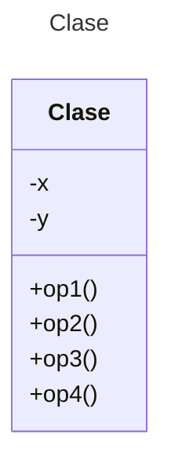

# Proyecto - Motores (Adaptador)

Se está construyendo el software controlador para diversas opciones de Motores en Automóviles. Actualmente se posee controladores para dos tipos de motores: **MotorComun** y **MotorEconomico**. En ambos casos la interface de sus controladores ofrecen las mismas operaciones:

- **Encender()**
- **Acelerar()**
- **Apagar()**

La empresa automotriz está considerando un nuevo tipo de **MotorElectrico**. El proyecto es experimental y se desea continuar con la misma línea de automóviles, pero ahora con la posibilidad de incorporar este tipo de Motor no contaminante. El fabricante (japonés) del **MotorElectrico** provee a sus usuarios un controlador software que posee las siguientes operaciones en su interface:

* **Conectar()**
* **Activar()**
* **aumentarVelocidad()**
* **detener()**
* **desconectar()**

Algunos automóviles actuales ofrecen un diseño de motor que permite incluir dos tipos de motores (de gasolina y eléctrico) para mayor eficiencia. En este tipo de automóvil, cuando se ha terminado la batería para el motor eléctrico entra en operación el motor a gasolina, digamos es un tipo de **MotorHíbrido**, con la interface:

* **Encendiendo()**
* **Acelerando()**
* **Apagando()**

Ofrezca un diseño, basado principalmente en el patrón Adaptador para implementar un diseño orientado a objetos que maneje estos requisitos para los nuevos tipos de motor (**Eléctrico** e **Híbrido**), junto con los dos originales (**Común** y **Económico**).

**CASOS DE PRUEBA:**

Implemente cuatro escenarios de prueba que demuestren el correcto funcionamiento de su aplicación. Los escenarios deberán demostrar para cada motor su funcionamiento con las operaciones siguientes:
* Configurar el automóvil con un cierto tipo de motor.
* Encender el automóvil
* Acelerar el automóvil
* Apagar el automóvil 

# Diagrama de clases
[Editor en línea](https://mermaid.live/)

[Referencia-Mermaid](https://mermaid.js.org/syntax/classDiagram.html)

# Uso del proyecto con make

## Default - Compilar+Probar+Ejecutar
```
make
```
## Compilar
```
make compile
```
## Probar todo
```
make test
```
## Ejecutar App
```
make run
```
## Limpiar binarios
```
make clean
```
# Comandos Git-Cambios y envío a Autograding

## Por cada cambio importante que haga, actualice su historia usando los comandos:
```
git add .
git commit -m "Descripción del cambio"
```
## Envíe sus actualizaciones a GitHub para Autograding con el comando:
```
git push origin main
```
# Comandos individuales
## Compilar

```
find ./ -type f -name "*.java" > compfiles.txt
javac -d build -cp lib/junit-platform-console-standalone-1.5.2.jar @compfiles.txt
```
Ejecutar ambos comandos en 1 sólo paso:

```
find ./ -type f -name "*.java" > compfiles.txt ; javac -d build -cp lib/junit-platform-console-standalone-1.5.2.jar @compfiles.txt
```


## Ejecutar Todas la pruebas locales de 1 Test Case

```
java -jar lib/junit-platform-console-standalone-1.5.2.jar -class-path build --select-class miTest.AppTest
```
## Ejecutar 1 prueba local de 1 Test Case

```
java -jar lib/junit-platform-console-standalone-1.5.2.jar -class-path build --select-method miTest.AppTest#appHasAGreeting
```
## Ejecutar App
```
java -cp build miPrincipal.Principal
```
Los comandos anteriores están considerados para un ambiente Linux. [Referencia.](https://www.baeldung.com/junit-run-from-command-line)
